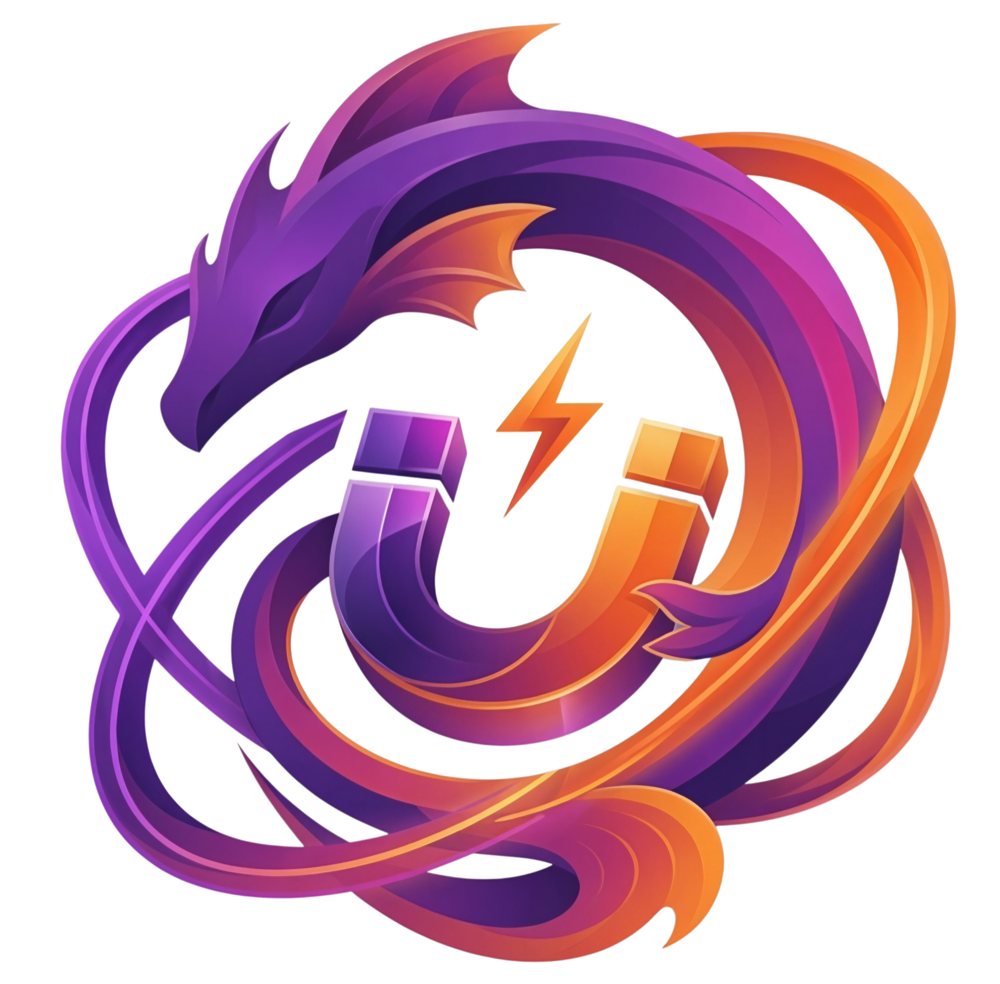

<div align="center">

  <a href="https://leviathanaddon.dpdns.org" target="_blank">
    
  </a>

  <br>

  

  <br>

  

  <p>
    <a href="https://leviathanaddon.dpdns.org" target="_blank">
      
    </a>
    
    
    
  </p>

  <h3>🔱 A clean stream intelligence layer for Stremio</h3>

  <p>
    <b>Leviathan unifies torrent engines, web providers, anime mapping, and RD/TorBox cloud</b><br>
    into a fast, structured, deduplicated pipeline designed to prioritize real <b>ITA</b> results<br>
    while keeping <b>ENG</b> support available when needed.
  </p>

  <p>
    <sub>
      Semantic matching · ITA-first ranking · Adaptive cache · Kitsu-aware anime logic · Kraken runtime · Clean Stremio output
    </sub>
  </p>

  

</div>

---

<div align="center">
  <h2>What Leviathan Is</h2>
  <p><b>Not a simple scraper. Not a simple addon.</b></p>
</div>

Leviathan is an aggregation engine for Stremio, designed to search, normalize, filter, and present results in a smarter way.

Its goal is simple: reduce noise, avoid unnecessary duplicates, improve matching quality, and give the user a cleaner, more readable stream list that is closer to what they are actually looking for.

It works across multiple synchronized sources:

- **Torrent engine** for P2P and magnet results.
- **Web providers** for Italian sources and hoster routes.
- **Anime providers** with Kitsu-aware logic.
- **Saved Cloud Layer** for files already available on Real-Debrid and TorBox.
- **Kraken Runtime** for the most delicate flows: forwarding, challenges, embeds, hosters, and MediaFlow compatibility.

<div align="center">
  
  
  
</div>

---

<div align="center">
  <h2>Legal & Usage Notice</h2>
</div>

> [!IMPORTANT]
> **Leviathan is a technical framework for aggregation, parsing, normalization, and routing. It does not host, store, sell, or distribute media content.**

Use of the project, configured providers, external services, bridges, resolvers, cloud layers, and any companion components is entirely the responsibility of the end user.

Anyone who installs, modifies, distributes, or uses Leviathan must ensure they operate in compliance with applicable laws, third-party rights, licenses, the terms of service of the providers involved, and the rules of connected services.

Leviathan is published for technical, educational, and research purposes: the study of aggregation architectures, interoperability between clients and services, parsing, ranking, formatting, cache policies, operational resilience, and delivery logic.

The **Saved Cloud Layer** only recognizes items already present in the Real-Debrid or TorBox accounts configured by the user. Leviathan provides the software engine; the user remains responsible for what they enable, connect, and use.

<sub>This notice does not constitute legal advice.</sub>

---

<div align="center">
  <h2>Why Leviathan Feels Different</h2>
</div>

Leviathan does not simply add more sources. It tries to understand which results actually make sense.

**Semantic Core**  
It analyzes title, year, season, episode, quality, language, release patterns, and reliability signals. A result is not treated as valid just because it contains similar words.

**ITA-first Logic**  
It prioritizes real Italian results, with clearer distinction between ITA, MULTI, SUB-ITA, ENG, and ambiguous releases.

**Clean Deduplication**  
It avoids showing the same content multiple times when it is found through different sources. If a regular result is also already available in the user's cloud, Leviathan highlights it without creating confusion.

**Adaptive Cache**  
It does not use blind caching. Freshly released content is handled more carefully, while stable content can be reused more aggressively.

**Kraken-ready Runtime**  
More fragile providers can be delegated to Kraken, allowing Leviathan to stay focused on search, ranking, deduplication, and formatting.

---

<div align="center">
  <h2>Release Focus</h2>
</div>

<div align="center">
  
  
  
  
</div>

<br>

- **RD/TorBox Saved Cloud**: recognizes files already saved in the user's cloud and integrates them without duplicates.
- **Core Refactoring**: a cleaner, more readable, and more stable pipeline under load.
- **Web Provider Routing**: coordinated handling of Italian providers, anime providers, intermediate bridges, and hoster extractors.
- **Polymorphic Formatter**: cleaner, hierarchical, and easier-to-read Stremio output.
- **Language Control**: dedicated modes for ITA, ENG, and Hybrid.
- **Direct Swarm Access**: direct P2P support for scenarios without debrid.

---

<div align="center">
  <h2>Saved Cloud Layer</h2>
  <p><code>RD/TorBox cloud-aware · optional · zero duplicates</code></p>
</div>

The **Saved Cloud Layer** checks files already saved in the user's personal cloud on **Real-Debrid** or **TorBox** and integrates them cleanly into the stream list.

The main pipeline remains unchanged: Leviathan first searches torrents, cache, external providers, and web results. After ranking, if cloud mode is enabled, it compares saved files by title, year, season, episode, anime/absolute episode, quality, and language.

It works in three modes:

- **smart**: uses the cloud when it can genuinely improve the result.
- **fallback**: steps in mainly when the main pipeline is not enough.
- **always**: always checks the cloud while still excluding duplicates.

Cloud streams are marked with `☁️ RD` or `☁️ TB` and can use dedicated routes:

```text
/play_saved_cloud/rd/...
/play_saved_cloud/tb/...
```

---

<div align="center">
  <h2>Anime & Kitsu Intelligence</h2>
  <p><code>Anime-first matching · Kitsu-aware context · episode collision control</code></p>
</div>

Leviathan includes dedicated logic for anime content and Kitsu-based flows.

The anime layer helps reduce mismatches between seasons, absolute episodes, alternative titles, and series with complex naming. This is useful for titles like **One Piece**, **Jujutsu Kaisen**, and other anime where numbering, arcs, specials, and release packs can create confusion.

The system combines:

- anime-first matching;
- Kitsu context;
- season/episode control;
- more targeted queries;
- anti-collision ranking;
- dedicated anime providers.

Providers and engines aligned with the anime flow:

- **AnimeWorld**
- **AnimeUnity**
- **AnimeSaturn**
- **Nyaa**
- **SubsPlease**

---

<div align="center">
  <h2>Adaptive Cache Intelligence</h2>
  <p><code>Volatility-aware · confidence-weighted · safer fresh releases</code></p>
</div>

Leviathan's cache does not behave like a passive container.

It evaluates content age, matching strength, result quality, agreement between sources, and the risk of freezing an unstable state too early.

In practice:

- freshly released content is reused more carefully;
- established releases can benefit from more aggressive caching;
- weak results are not promoted too early;
- cache becomes part of the ranking, not just a speed layer.

---

<div align="center">
  <h2>Cloudflare Session Store</h2>
  <p><code>Redis-backed clearance sharing · fewer duplicate solves · better multi-worker behavior</code></p>
</div>

Leviathan can share Cloudflare clearances, cookie jars, and browser fingerprints between the API, workers, and multiple instances through Redis.

When a provider requires CloudflareBypassForScraping, the first process that encounters the challenge acquires a temporary lock. Other processes wait for the shared session instead of opening duplicate solves.

After a clearance is available, Leviathan also applies a shared traffic guard to protected providers: identical requests are coalesced, hot pages can be served from short-lived cache, and per-domain pacing prevents hundreds of users from triggering hundreds of live scrapes at once.

This reduces browser load, origin pressure, timeouts, and ban risk in deployments with multiple workers or containers.

Main variables:

```env
CF_REDIS_SESSION_ENABLED=true
CF_REDIS_NATIVE_ENABLED=true
CF_REDIS_LOCK_ENABLED=true
CF_REDIS_SESSION_TTL_SECONDS=21600
CF_REDIS_NATIVE_TTL_SECONDS=1500
CF_REDIS_LOCK_TTL_MS=45000
CF_REDIS_LOCK_WAIT_MS=52000
```

> [!NOTE]
> If Redis is not available, Leviathan can continue using the local fallback. To preserve clearances after a Redis restart, enable Redis/AOF persistence.

---

<div align="center">
  <h2>Kraken Runtime</h2>
  <p><code>Leviathan-native companion · forward transport · hoster orchestration</code></p>
</div>

**Kraken** is the recommended companion runtime for Leviathan.

It is not a generic proxy: it centralizes the most delicate paths when redirects, intermediate embeds, sessions, challenges, captchas, required headers, or MediaFlow compatibility are involved.

It is especially useful for:

- MaxStream / UPROT;
- VOE and compatible aliases;
- VidGuard / listeamed;
- providers with fragile fetching;
- MediaFlow-compatible bridges;
- handoff to local or remote extractors.

Typical configuration:

```env
KRAKEN_URL=https://your-kraken-instance.example
KRAKEN_API_PASSWORD=your_password
FORWARD_PROXY=https://your-kraken-instance.example/forward
```

> [!IMPORTANT]
> CloudflareBypassForScraping is now the browser-based Cloudflare layer. When a full browser solve is too heavy, Kraken Forward / curl_cffi-like transport remains the faster first path.

---

<div align="center">
  <h2>Network Map</h2>
  <p><code>Cloud · Web providers · Torrent engines · Hoster extractors</code></p>
</div>

Leviathan uses multiple layers, but the flow remains linear:

```text
Request Stremio
→ metadata normalization
→ provider / torrent / cloud discovery
→ semantic matching
→ deduplication
→ ranking
→ formatter
→ clean stream output
```

**Cloud & Bridge**

- Real-Debrid Saved Cloud
- TorBox Saved Cloud
- Torrentio bridge
- MediaFusion bridge

**Web provider layer**

- StreamingCommunity
- Altadefinizione
- GuardaHD
- GuardoSerie
- GuardaFlix
- Eurostreaming
- ToonItalia
- OnlineSerieTV
- Moflix POC, disabled by default

**Anime layer**

- AnimeWorld
- AnimeUnity
- AnimeSaturn
- Kitsu-aware eligibility

**Torrent engine layer**

- Il Corsaro Nero
- Knaben
- The Pirate Bay / mirror
- 1337x
- BitSearch
- LimeTorrents
- RARBG
- UIndex
- Nyaa
- SubsPlease

**Hoster extractor layer**

- VixCloud / VixSrc aliases
- VOE family
- VidGuard / listeamed family
- MixDrop and aliases
- SuperVideo
- StreamTape
- UpStream
- Uqload
- Vidoza
- Dropload
- LoadM
- DeltaBit
- MaxStream / UPROT

---

<div align="center">
  <h2>Provider Policy</h2>
</div>

Leviathan avoids using every provider in every context. Each module has a more precise scope.

- Anime providers run only when the request is compatible with anime/Kitsu.
- GuardaFlix remains movie-oriented.
- Eurostreaming works as an ITA web provider with dedicated hoster routing.
- ToonItalia is optional and designed for anime/cartoons.
- OnlineSerieTV is experimental and prefers SearchWP + Kraken Forward.
- Moflix remains disabled by default and can be used as a controlled TMDB-based fallback.
- MediaFusion is used as an optional external bridge, not as a replacement for the main pipeline.
- Kraken is recommended for advanced providers/hosters, especially when challenges, fragile embeds, or HLS proxying are involved.

---

<div align="center">
  <h2>Deployment</h2>
</div>

<div align="center">
  
  
</div>

<br>

Standard bootstrap:

```bash
git clone https://github.com/LUC4N3X/stremio-leviathan-addon
cd stremio-leviathan-addon
docker compose up -d --build
```

Local endpoint:

```text
http://localhost:7000
```

---

<div align="center">
  <h2>Core File Atlas</h2>
  <p><code>A compact map of the most important Leviathan files</code></p>
</div>

<details>
<summary><b>Saved Cloud Layer</b></summary>

- `core/stream/debrid_saved_cloud.js` — RD/TorBox scanner and matching.
- `debrid/realdebrid.js` — Real-Debrid cloud reading and resolving.
- `debrid/torbox.js` — TorBox cloud reading and resolving.
- `core/config/schema.js` — cloud options normalization.
- `core/stream_generator.js` — cloud insertion into the stream pipeline.
- `core/server/routes/playback_routes.js` — dedicated playback routes.
- `core/lib/stream_formatter.js` — main formatter.
- `public/index.html` and `public/smartphone.js` — desktop/mobile configurators.

</details>

<details>
<summary><b>Provider & Runtime Layer</b></summary>

- `providers/extractors/provider_registry.js` — central provider/extractor registry.
- `providers/engines.js` — torrent engines.
- `core/nexus-bridge/torrentio.js` — Torrentio bridge.
- `core/nexus-bridge/mediafusion.js` — MediaFusion bridge.
- `providers/extractors/bridge_resolver.js` — bridge page and iframe normalization.
- `providers/extractors/hosters/` — local and Kraken-assisted hoster resolvers.

</details>

<details>
<summary><b>Web Provider Modules</b></summary>

- `providers/streamingcommunity/vix_handler.js` — StreamingCommunity / Vix.
- `providers/altadefinizione/ads_handler.js` — Altadefinizione.
- `providers/guardahd/ghd_handler.js` — GuardaHD.
- `providers/guardoserie/gs_handler.js` — GuardoSerie.
- `providers/guardaflix/gf_handler.js` — GuardaFlix.
- `providers/eurostreaming/es_handler.js` — Eurostreaming, Safego/Clicka, DeltaBit, MixDrop, MaxStream.
- `providers/toonitalia/toonitalia_handler.js` — ToonItalia.
- `providers/onlineserietv/onlineserietv_handler.js` — OnlineSerieTV.
- `providers/moflix/moflix_handler.js` — Moflix POC.

</details>

<details>
<summary><b>Anime Sources</b></summary>

- `providers/animeworld/aw_handler.js` — AnimeWorld, Kitsu/anime context, VidGuard handoff.
- `providers/animeunity/au_handler.js` — AnimeUnity.
- `providers/animesaturn/as_handler.js` — AnimeSaturn.

</details>

---

<div align="center">
  <h2>Self-Hosting Reality Check</h2>
</div>

> [!IMPORTANT]
> **Leviathan can be self-hosted, but the public version may have operational advantages that are not included in the repository.**

The repository contains the project code, but it does not necessarily include:

- the public instance database;
- prebuilt server-side caches;
- operational history;
- private tuning from the live instance;
- warm-cache advantages and already optimized infrastructure.

In self-hosting, Leviathan may require more live scraping, greater VPS dependency, and more attention to provider configuration. It remains useful for study, development, and personal use, but it does not automatically replicate the behavior of the live instance.

The **Saved Cloud Layer** remains useful even in self-hosting because it depends on the user's personal RD/TorBox cloud.

---

<div align="center">
  <h2>Recommended Setup</h2>
  <p><code>Clean install · balanced configuration · best results first</code></p>

  
</div>

Leviathan works best when it is kept simple, focused, and connected only to the services you actually use.

For most users, the ideal setup is:

- enable **ITA-first** when Italian results are the priority;
- use **Hybrid** mode only when ENG fallback is useful;
- connect **Real-Debrid** or **TorBox** if you want saved-cloud discovery;
- keep **Kraken** available for fragile providers, embeds, and hoster routes;
- avoid enabling every experimental provider unless you are testing or developing.

<div align="center">
  
  
  
</div>

> [!TIP]
> If you are self-hosting, start with the default configuration, verify the core stream output, then enable advanced providers and runtime integrations one layer at a time.


---

<div align="center">

  

  <br>

  <a href="https://github.com/LUC4N3X" target="_blank">
    
  </a>

  <br>

  

  <h3>Founder · Core Architect · Lead Engineering</h3>

  <p>
    <b>Concept, architecture, and technical direction of Leviathan.</b><br>
    Protocol design, core module integration, aggregation pipeline,<br>
    project identity, and evolutionary guidance for the entire system.
  </p>

  
  
  

  <br><br>

  <h2>Special Thanks</h2>

  <p>
    <a href="https://github.com/UrloMythus/MammaMia" target="_blank">
      
    </a>
  </p>

  <p>
    Thanks to the <b>MammaMia</b> project for openly sharing provider-flow ideas and logic patterns<br>
    that helped inform parts of Leviathan's provider strategy.
  </p>

  <p>
    <a href="https://github.com/mhdzumair/mediaflow-proxy" target="_blank">
      
    </a>
  </p>

  <p>
    Thanks to <b>MediaFlow Proxy</b> for its extractor ecosystem and media-routing concepts,<br>
    used as a valuable technical reference while shaping Leviathan's runtime integrations.
  </p>

  
  
  

  <br><br>

  <b>Not a simple addon. Not a simple scraper.</b><br>
  <sub>An operational layer built to push Stremio beyond default behavior.</sub>

  <br><br>

  

</div>

